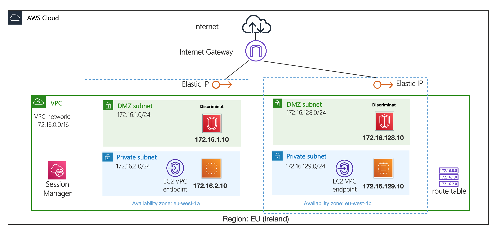
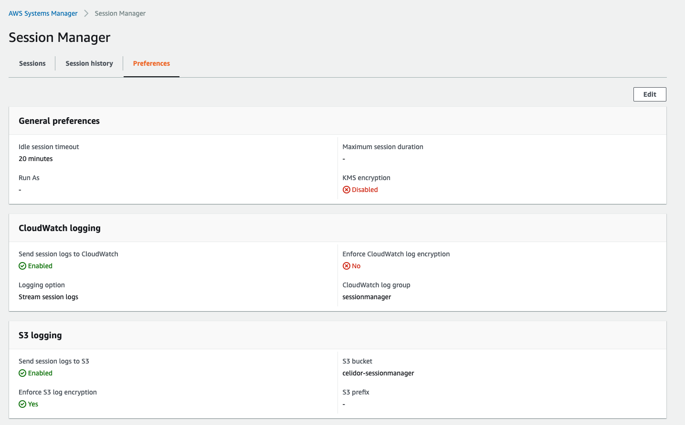
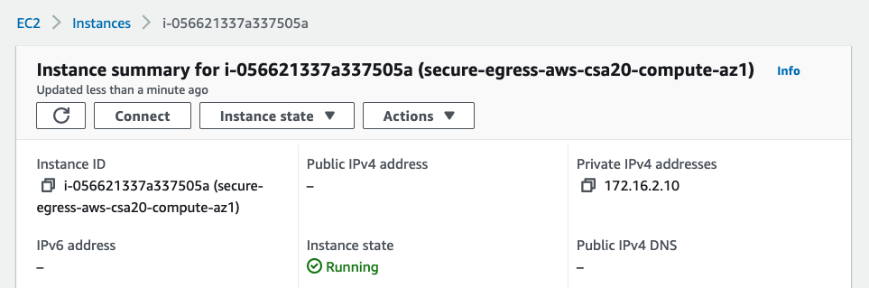
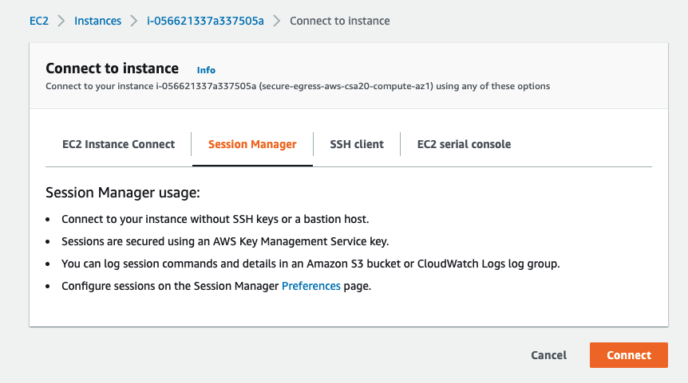
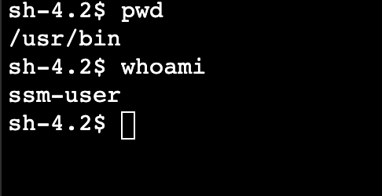

# aws-egress
Controlled egress to authorised domains from AWS




## requirements
* in AWS MarketPlace, subscribe to Amazon Linux 2
* in AWS MarketPlace, subscribe to Discriminat
* at AWS Systems Manager, Session Manager, Preferences, configure as below
* create CloudWatch log group `sessionmanager` if needed



## usage
* deploy with the Terraform state file on your laptop
```
terraform init
terraform workspace new dev
terraform plan
terraform apply
```

## connecting to virtual machines
* A remote SSH session in the AWS console doesn't require a SSH key
* In the AWS Console, EC2, select the instance

  
* Press Connect
* Choose the Session Manager tab
* 
  
* You now have a remote bash shell session in your browser



## changing between Discriminat and AWS NAT Gateways
* change the variable `discriminat` from `true` to `false` or override using `terraform.tfvars`
* apply Terraform
